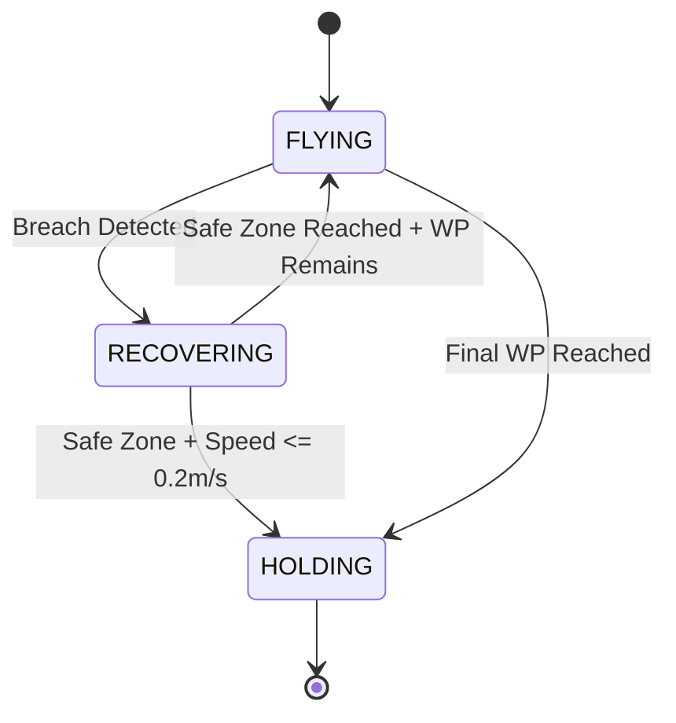
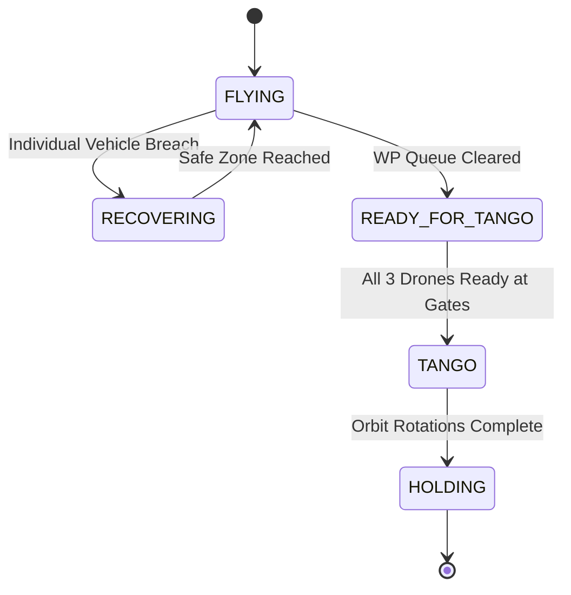

# Autonomous Drone Geofence Guard & Multi-Agent Formation Control

A closed-loop 3D geofence safety controller and multi-agent formation flight stack for ArduCopter, built in Python using **PyMAVLink** against **ArduPilot SITL**, paired with a real-time **MATLAB** telemetry dashboard over UDP.

This repository documents the evolution of a safety layer from a **single-vehicle reactive guard** to a **3-drone dynamic formation and collision-avoidance system**.

**Stack:** Python · PyMAVLink · ArduPilot SITL · MATLAB · MAVLink (`SET_POSITION_TARGET_LOCAL_NED`)

---

## Why This Exists

Autonomous multi-vehicle systems require a safety layer independent of primary mission logic—a mechanism capable of overriding invalid waypoints or telemetry disruptions to return vehicles to safe airspace without human intervention.

This repository provides that layer: an autonomous geofence guard operating between mission planning and vehicle control.

---

# Architecture Evolution

## Phase 1: Single-Drone Geofence Guard

**Location:** `single_drone/geofence_guard.py`

A standalone safety layer governing a single vehicle.

If a waypoint breaches the 3D boundary, the guard:

* Detects the geofence violation
* Aborts the invalid waypoint
* Calculates a recovery vector toward the central origin
* Commands velocity-based recovery
* Slows the vehicle near geofence boundaries
* Gates recovery completion on both position and velocity
* Transitions to holding once the vehicle has settled

### State Machine



---

## Phase 2: Multi-Drone Formation & Collision Avoidance

**Location:** `multi_drone/multi_GeoFence.py`

The system scales the safety architecture to **3 quadcopters** running parallel control loops.

Features include:

* Independent geofence monitoring
* Independent breach recovery
* Dynamic all-pairs collision detection
* Inter-drone separation enforcement
* Coordinated waypoint execution
* Synchronized formation entry
* 120°-phased circular orbit formation
* Position-hold after formation completion

The final coordinated maneuver is called **"Triangle Tango."**

### State Machine



---

# Control & Safety Architecture

## Proportional Kinematic Control

Each axis is controlled independently using a proportional position-error controller with velocity limits.

velocity = clamp(-v_max, v_max, Kp * (target - current))

Where:

* $K_p = 1.3$
* Horizontal maximum velocity = **6.0 m/s**
* Vertical maximum velocity = **1.5 m/s**

The commanded velocity is additionally modified by the adaptive geofence slowdown system.

---

## Adaptive Wall Proximity Slowdown

The controller continuously evaluates the shortest distance to all six geofence faces.

When a vehicle enters the **8.0 m proximity buffer**, its maximum velocity is reduced linearly.

fence_speed = 1.0                              if min_wall_dist >= 8.0 m
fence_speed = max(0.15, min_wall_dist / 8.0)  if min_wall_dist <  8.0 m

adaptive_max_horiz = 6.0 * fence_speed   # m/s
adaptive_max_vert  = 1.5 * fence_speed   # m/s

This allows vehicles to decelerate before reaching the hard geofence boundary rather than waiting until after a breach occurs.

---

## Velocity-Gated Settling

Recovery does not complete solely because the vehicle has returned to a safe position.

The vehicle must also have sufficiently low velocity to prevent position-hold oscillation or overshoot.

Recovery is considered complete when:

current_speed = sqrt(vx^2 + vy^2 + vz^2)
ready_to_hold = in_safe_radius AND (current_speed <= 0.2 m/s)

This provides both:

1. **Spatial compliance**
2. **Kinematic settling**

before transitioning into `HOLDING`.

---

## Multi-Pair Collision Avoidance

The multi-drone controller evaluates 3D Euclidean separation between every vehicle pair:

* Drone 1 ↔ Drone 2
* Drone 1 ↔ Drone 3
* Drone 2 ↔ Drone 3

If the separation falls below **4.0 m**, opposing lateral velocity vectors are applied to increase separation.

distance = sqrt((x1 - x2)^2 + (y1 - y2)^2 + (z1 - z2)^2)

Collision avoidance therefore operates independently of the individual geofence recovery logic.

---

# Geofence Bounds

The system operates in the ArduPilot **Local NED coordinate frame**.

| Axis |   Limit | Description          |
| ---- | ------: | -------------------- |
| X    | ±25.0 m | North/South boundary |
| Y    | ±25.0 m | East/West boundary   |
| Z    | -20.0 m | Maximum altitude     |
| Z    |  -3.0 m | Minimum altitude     |

The resulting protected volume is a 50 m × 50 m × 17 m 3D flight region.

---

# Real-Time Telemetry Dashboard

The multi-drone controller streams telemetry as JSON packets over **UDP port `5005`**.

The included MATLAB dashboard:

`live_drone_dashboard_2D.m`

provides real-time visualization of the simulated vehicles.

### Dashboard Features

* **2D top-down spatial map**

  * Drone trajectories
  * Geofence perimeter
  * Current vehicle positions
  * Proximity alert lines

* **Debounced event annotations**

  * Red `X` markers for 2D geofence breaches
  * Red `v` markers for altitude boundary violations

* **Altitude profile**

  * Real-time altitude tracking
  * Ceiling visualization
  * Floor visualization

---

# Sample Execution Logs

## Single-Drone Mission

```text
Generated Mission Queue: [(-9.13, 4.07, -6.75), (-16.97, 18.04, -5.32), (26.9, -22.87, -10.09)]
Arming vehicle...
Taking off to 10m...
[FLYING WP1] Pos: (5.99, -3.94, -10.01)m | Actual Speed: (0.00, -0.02, 0.00)m/s | Cmd Speed: (-5.26, 5.26, 1.31)m/s
...
[WAYPOINT 1 REACHED] At (-8.16, 4.51, -6.74)m
Advancing to Next Waypoint: (-16.97, 18.04, -5.32)
...
[WAYPOINT 2 REACHED] At (-16.95, 16.89, -5.32)m
Advancing to Next Waypoint: (26.9, -22.87, -10.09)
...
[FLYING WP3] Pos: (24.66, -23.71, -10.08)m | Actual Speed: (3.84, -3.85, 0.02)m/s | Cmd Speed: (0.90, 0.90, -0.02)m/s

*** 3D GEOFENCE BREACH AT Pos:(25.56, -24.62, -10.07)m! ***

Aborting invalid waypoint (26.9, -22.87, -10.09) and executing recovery...

*** RECOVERY COMPLETE AT (4.27, -5.16, -10.01)m! ***

[RECOVERING] Pos: (4.27, -5.16, -10.01)m | Cmd Speed: (-5.00, 5.00, 0.01)m/s
[HOLDING] Target WP:(26.9, -22.87, -10.09) | Pos: (4.2, -5.1, -10.0)m
[HOLDING] Target WP:(26.9, -22.87, -10.09) | Pos: (4.1, -5.0, -10.0)m
[HOLDING] Target WP:(26.9, -22.87, -10.09) | Pos: (3.9, -4.9, -10.0)m
[HOLDING] Target WP:(26.9, -22.87, -10.09) | Pos: (3.8, -4.7, -10.0)m
[HOLDING] Target WP:(26.9, -22.87, -10.09) | Pos: (3.6, -4.5, -10.0)m
[HOLDING] Target WP:(26.9, -22.87, -10.09) | Pos: (3.5, -4.5, -10.0)m
[HOLDING] Target WP:(26.9, -22.87, -10.09) | Pos: (3.6, -4.6, -10.0)m
```

---

## Multi-Drone Mission

```text
python3 multi_GeoFence.py
Connecting to Drone 1 on udpin:localhost:14551...
[Drone 1] Setting GUIDED mode...
[Drone 1] Arming motors...
[Drone 1] Taking off to 5m...
Connecting to Drone 2 on udpin:localhost:14561...
[Drone 2] Setting GUIDED mode...
[Drone 2] Arming motors...
[Drone 2] Taking off to 5m...
Connecting to Drone 3 on udpin:localhost:14571...
[Drone 3] Setting GUIDED mode...
[Drone 3] Arming motors...
[Drone 3] Taking off to 5m...

All 3 Drones Connected, Armed, and Ready. Starting Loop...

[Drone 1 - FLYING] Pos:(5.4, -5.6, -10.0)m -> Target:(-21.7, -24.4, -1.0)m | Cmd Vel:(-5.26, -5.26, 1.31)m/s
[Drone 2 - FLYING] Pos:(2.9, 7.2, -10.0)m -> Target:(-25.7, 22.9, -6.1)m | Cmd Vel:(-5.25, 5.25, 1.31)m/s
[Drone 3 - FLYING] Pos:(-7.8, -1.0, -10.0)m -> Target:(11.7, -15.4, -6.8)m | Cmd Vel:(5.25, -5.25, 1.31)m/s
...
>>> [Drone 3] Reached WP1 at (11.15, -16.18, -6.77)m

*** [Drone 3] GEOFENCE BREACH at (25.35, -2.33, -10.12)m! ***
>>> [Drone 2] Reached WP1 at (-24.30, 22.91, -6.12)m

*** [Drone 2] GEOFENCE BREACH at (-25.08, 22.90, -6.15)m! ***
*** [Drone 1] GEOFENCE BREACH at (-19.60, -24.35, -2.97)m! ***

[Drone 1 - RECOVERING] Pos:(-20.1, -24.4, -3.0)m -> Target:(0.0, 0.0, -10.0)m | Cmd Vel:(5.00, 5.00, -2.00)m/s
[Drone 2 - RECOVERING] Pos:(-16.9, 15.0, -10.8)m -> Target:(0.0, 0.0, -10.0)m | Cmd Vel:(5.00, -5.00, 0.99)m/s
[Drone 3 - RECOVERING] Pos:(10.1, -0.0, -10.0)m -> Target:(0.0, 0.0, -10.0)m | Cmd Vel:(-5.00, 0.01, 0.01)m/s

[WARNING] PROXIMITY ALERT between Drone 1 and 2! Dist: 2.69m
...
>>> [Drone 1] Reached WP4 at (7.27, -0.02, -10.01)m

[Drone 1 - TANGO] Pos:(-5.8, 3.5, -10.0)m -> Cmd Pos:(-7.3, -3.2, -10.0)m
[Drone 2 - TANGO] Pos:(7.1, -3.2, -10.0)m -> Cmd Pos:(7.5, 2.8, -10.0)m
[Drone 3 - TANGO] Pos:(-0.8, 7.8, -10.0)m -> Cmd Pos:(-6.2, 5.1, -10.0)m

*** TRIANGLE TANGO COMPLETE -- SWITCHING TO POSITION HOLD ***

[Drone 1 - HOLDING] Pos:(8.2, -1.0, -10.0)m -> Cmd Pos:(5.4, -5.6, -10.0)m
[Drone 2 - HOLDING] Pos:(-3.2, 7.6, -10.0)m -> Cmd Pos:(2.1, 7.5, -10.0)m
[Drone 3 - HOLDING] Pos:(-5.0, -6.6, -10.0)m -> Cmd Pos:(-7.5, -1.9, -10.0)m
```

---

# Configuration & QGroundControl Integration

When running QGroundControl alongside ArduPilot SITL:

* Avoid manually created QGroundControl communication links.
* `sim_vehicle.py` automatically streams telemetry over UDP.
* Manual links can create port conflicts and stale connection states.
* Ensure **UDP AutoConnect** is enabled in QGroundControl.
* Delete manual link configurations when using the native SITL connections.

For multi-vehicle SITL, each vehicle is assigned its own instance and MAVLink port.

---

# Running the Project

## 1. Single-Drone Guard

### Terminal 1 — Launch SITL

```bash
sim_vehicle.py -v ArduCopter --out=udp:127.0.0.1:14551
```

### Terminal 2 — Launch Guard

```bash
python3 single_drone/geofence_guard.py
```

---

## 2. Multi-Drone System

### Terminal 1 — Drone 1

```bash
sim_vehicle.py -v ArduCopter -I0 \
    --out=udp:127.0.0.1:14550 \
    --out=udp:127.0.0.1:14551 \
    --sysid=1
```

### Terminal 2 — Drone 2

```bash
sim_vehicle.py -v ArduCopter -I1 \
    --out=udp:127.0.0.1:14560 \
    --out=udp:127.0.0.1:14561 \
    --sysid=2
```

### Terminal 3 — Drone 3

```bash
sim_vehicle.py -v ArduCopter -I2 \
    --out=udp:127.0.0.1:14570 \
    --out=udp:127.0.0.1:14571 \
    --sysid=3
```

### Terminal 4 — MATLAB Dashboard

Open MATLAB and run:

```matlab
live_drone_dashboard_2D.m
```

### Terminal 5 — Multi-Drone Controller

```bash
python3 multi_drone/multi_GeoFence.py
```

---

# Project Structure

```text
.
├── single_drone/
│   └── geofence_guard.py
│
├── multi_drone/
│   └── multi_GeoFence.py
│
├── matlab/
│   └── live_drone_dashboard_2D.m
│
└── README.md
```

---

# Key Technologies

| Technology                      | Role                              |
| ------------------------------- | --------------------------------- |
| Python                          | Flight-control and safety logic   |
| PyMAVLink                       | MAVLink communication             |
| ArduPilot SITL                  | Multi-vehicle simulation          |
| ArduCopter                      | Simulated vehicle firmware        |
| MAVLink                         | Vehicle telemetry and commands    |
| `SET_POSITION_TARGET_LOCAL_NED` | Velocity/position control         |
| MATLAB                          | Real-time telemetry visualization |
| UDP                             | Telemetry transport               |

---

# System Summary

The project evolves through two control architectures:

```text
Single Drone
     │
     ▼
3D Geofence Detection
     │
     ▼
Velocity-Based Recovery
     │
     ▼
Velocity-Gated Hold
     │
     ▼
Multi-Drone Expansion
     │
     ├── Independent Geofence Guards
     │
     ├── All-Pairs Collision Avoidance
     │
     ├── Coordinated Waypoint Execution
     │
     ├── Formation Synchronization
     │
     └── Triangle Tango Orbit
```

The resulting system demonstrates a layered autonomous safety architecture capable of detecting geofence violations, autonomously recovering individual vehicles, maintaining inter-drone separation, and coordinating multiple vehicles through a synchronized formation maneuver.
