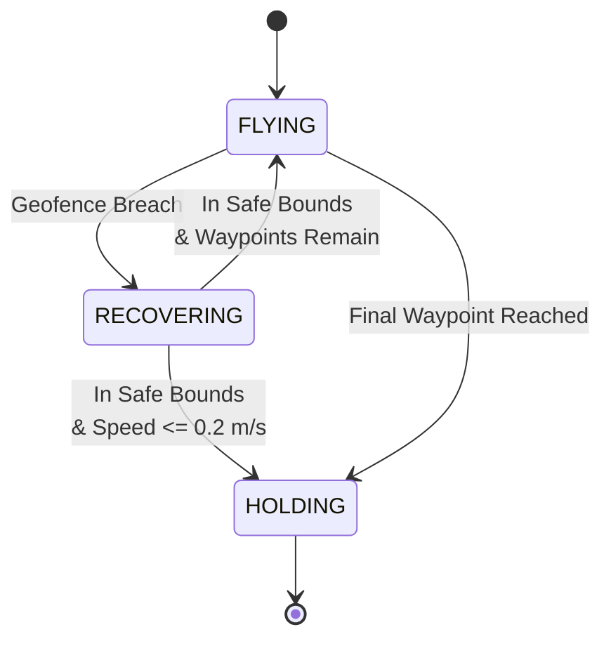

# Virtual Safety Boundary Guard & Emergency Disturbance Recovery

A closed-loop 3D geofence safety controller for ArduCopter, built in Python with PyMAVLink against ArduPilot SITL. The controller continuously monitors real-time vehicle telemetry, enforces a 3D geofence, and autonomously recovers the vehicle when a breach occurs — using proportional velocity control and a velocity-gated state machine to avoid overshoot on recovery.

This is a supporting artifact for a larger multi-drone recon system (master/follower architecture, in progress). It's the first fully demonstrable closed-loop control piece in that project.

**Stack:** Python · PyMAVLink · ArduPilot SITL · MAVLink (`SET_POSITION_TARGET_LOCAL_NED`)

---

## Why this exists

Autonomous multi-vehicle systems need a safety layer that's independent of the mission logic — something that can override a bad waypoint or a communications hiccup and get the vehicle back inside safe airspace without operator intervention. This project is that layer: a standalone geofence guard that sits between the mission planner and the vehicle, ready to take over the moment a 3D boundary is violated.

## Architecture

Three-state finite state machine, driven off live `LOCAL_POSITION_NED` telemetry at the MAVLink stream rate:



- **FLYING** — proportional velocity control toward the current waypoint, with adaptive proximity slowdown near the fence walls.
- **RECOVERING** — Waypoint is aborted, and the vehicle is driven back toward a safe origin under a vector-based velocity controller.
- **HOLDING** — Vehicle switches from velocity control to position control (MAVLink bitmask swap) and locks onto a fixed coordinate with zero commanded velocity.

## Control design

### Proportional velocity control (FLYING / RECOVERING)

Each axis is driven independently by a simple P controller on position error, clamped to a max speed:

```
error   = target - current_position
velocity = clamp(-v_max, v_max, Kp * error)
```

with `Kp = 1.3`. Horizontal axes (X, Y) are capped at 6.0 m/s cruise, vertical (Z) at 1.5 m/s, before any proximity scaling is applied.

### Adaptive proximity slowdown

A second, softer safety layer runs independently of hard breach detection. The controller evaluates the shortest distance to any of the 6 geofence faces in real time, and within an 8.0 m proximity zone, linearly throttles cruise speed down:

```
min_wall_dist = min(dist_to_x_wall, dist_to_y_wall, dist_to_z_wall)

fence_speed = 1.0                                  if min_wall_dist >= 8.0 m
fence_speed = max(0.15, min_wall_dist / 8.0)        if min_wall_dist <  8.0 m

adaptive_max_horiz = 6.0 * fence_speed   # m/s
adaptive_max_vert  = 1.5 * fence_speed   # m/s
```

This means the vehicle is already decelerating well before it would ever hit a hard boundary, rather than relying purely on reactive recovery.

### Velocity-gated settling (RECOVERING → HOLDING)

Early iterations locked into a hold position based on spatial coordinates alone, causing visible wobble due to residual kinetic momentum. 
The residual velocity would carry the vehicle past the hold point, and the controller would fight it back and forth. The state transition from RECOVERING to HOLDING is now gated by boundary compliance and low total velocity theshold: 

```
current_speed = sqrt(vx^2 + vy^2 + vz^2)
ready_to_hold = in_safe_radius AND (current_speed <= 0.2 m/s)
```

### Geofence bounds (local NED frame)

| Axis | Limit |
|---|---|
| X (North/South) | ±25 m |
| Y (East/West) | ±25 m |
| Z ceiling | -20 m (20 m up) |
| Z floor | -3 m (3 m up) |

## Sample run

Real SITL output from a live 3-waypoint mission with a genuine breach/recovery cycle:

```
Generated Mission Queue: [(-9.13, 4.07, -6.75), (-16.97, 18.04, -5.32), (26.9, -22.87, -10.09)]
Arming vehicle...
Taking off to 10m...
[FLYING WP1] Pos: (5.99, -3.94, -10.01)m | Actual Speed: (0.00, -0.02, 0.00)m/s | Cmd Speed: (-5.26, 5.26, 1.31)m/s
...
[WAYPOINT 1 REACHED] At (-8.16, 4.51, -6.74)m
Advancing to Next Waypoint: (-16.97, 18.04, -5.32)
...
[WAYPOINT 2 REACHED] At (-16.95, 16.89, -5.32)m
Advancing to Next Waypoint: (26.9, -22.87, -10.09)
...
[FLYING WP3] Pos: (24.66, -23.71, -10.08)m | Actual Speed: (3.84, -3.85, 0.02)m/s | Cmd Speed: (0.90, 0.90, -0.02)m/s

*** 3D GEOFENCE BREACH AT Pos:(25.56, -24.62, -10.07)m! ***

Aborting invalid waypoint (26.9, -22.87, -10.09) and executing recovery...

*** RECOVERY COMPLETE AT (4.27, -5.16, -10.01)m! ***

[RECOVERING] Pos: (4.27, -5.16, -10.01)m | Cmd Speed: (-5.00, 5.00, 0.01)m/s
[HOLDING] Target WP:(26.9, -22.87, -10.09) | Pos: (4.2, -5.1, -10.0)m
[HOLDING] Target WP:(26.9, -22.87, -10.09) | Pos: (4.1, -5.0, -10.0)m
[HOLDING] Target WP:(26.9, -22.87, -10.09) | Pos: (3.9, -4.9, -10.0)m
[HOLDING] Target WP:(26.9, -22.87, -10.09) | Pos: (3.8, -4.7, -10.0)m
[HOLDING] Target WP:(26.9, -22.87, -10.09) | Pos: (3.6, -4.5, -10.0)m
[HOLDING] Target WP:(26.9, -22.87, -10.09) | Pos: (3.5, -4.5, -10.0)m
[HOLDING] Target WP:(26.9, -22.87, -10.09) | Pos: (3.6, -4.6, -10.0)m
```

Note the mission-generated waypoint 3 (26.9, -22.87, -10.09) is itself outside the ±25 m fence — this run demonstrates the guard catching and aborting an invalid waypoint mid-flight, recovering to a stable hold near the origin, and settling into HOLDING without wobble.

*(Full log saved separately in `logs/sample_run.log`)*

## Known limitations

- **$P$-Only Control Loop**: P-only control — no integral term (some steady-state lag is possible on long straight-line approaches) or derivative term (no explicit damping beyond the velocity-gated hold check). Working, but not tuned for minimum settling time.
- **Single-vehicle only** — this guard governs one drone. Multi-vehicle SITL (drone 2 aborting if drone 1 breaches) is the active next step.
- **Fixed recovery target** — RECOVERING always drives back toward the origin `(0, 0, -10m)` rather than the nearest safe point, so recovery distance can be long depending on where the breach happens.
- **SITL only** — validated in simulation (ArduPilot SITL + QGroundControl), not yet flown on hardware.
- **Straight-line NED geofence, no yaw awareness** — bounds are a simple box in the local NED frame; no polygon or dynamic geofence support yet.

## Requirements

```
pymavlink
```

Also requires a running ArduPilot SITL instance broadcasting on UDP port 14551 (SITL's default MAVLink output only goes to 14550 for QGroundControl — a second `--out=udp:127.0.0.1:14551` flag is needed at launch for this script to connect).

## Running it

```bash
# Terminal 1 — launch SITL with a second MAVLink output for this script
sim_vehicle.py -v ArduCopter --out=udp:127.0.0.1:14551

# Terminal 2 — run the guard
python3 geofence_guard.py
```

Optionally connect QGroundControl (default UDP 14550) alongside to watch the vehicle live.

## Roadmap

- Multi-vehicle SITL: second drone follows drone 1's commands, aborts if drone 1 breaches
- Master/follower click-to-move control interface (full multi-drone recon system)
- Hardware flight test once budget allows
